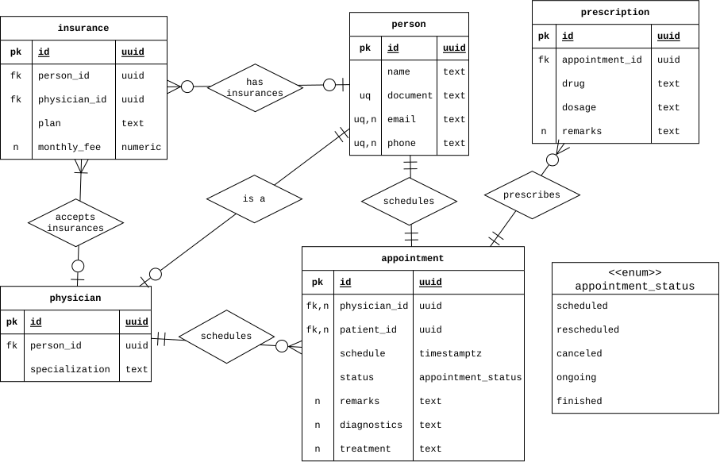
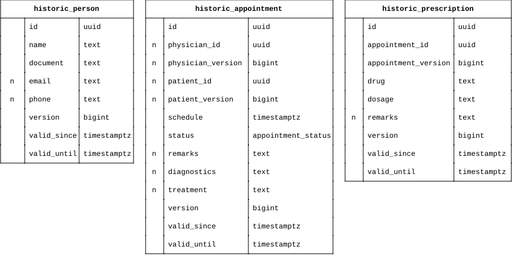
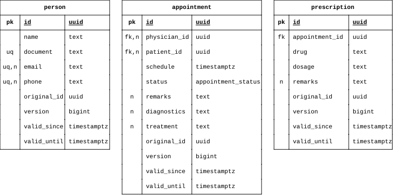
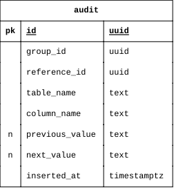

# Data Versioning Strategies in Relational Databases


Code and diagrams for the undergraduate thesis **"Comparative Analysis of Data Versioning Strategies in Relational Databases"** (*Análise Comparativa de Estratégias de Versionamento de Dados em Bancos de Dados Relacionais*), Information Systems, UNESPAR – União da Vitória campus, 2026.

**Author:** Matheus José Maidel  
**Advisor:** Prof. Saulo José Benvenutti

## About

Systems in fields such as finance, government and healthcare need to keep a reliable history of how their data changes. This project implements and compares different data versioning strategies in **PostgreSQL**, looking at their advantages, drawbacks, schema impact, performance and suitability for each context.

All strategies are applied to the same fictional scenario: an electronic medical record system with people, physicians, health insurance plans, appointments and prescriptions.

## Strategies

| Strategy | How it works | Extra columns / structures |
|---|---|---|
| **Historic tables** | Each table is paired with a `historic_*` table. Triggers copy every inserted or updated row into it and close the validity period of the previous version. | `version`, `valid_since`, `valid_until` (plus a version column for each foreign key) |
| **Row versioning (append-only)** | Versions live in the table itself. Updates keep the old row as a closed version; deletes become soft deletes by setting `valid_until`. Unique constraints become partial unique indexes over current rows. | `original_id`, `version`, `valid_since`, `valid_until` |
| **Audit table** | Business tables stay untouched. A single generic `audit` table records each change per column, storing old and new values as text. *(work in progress)* | `audit` table: `reference_id`, `table_name`, `column_name`, `previous_value`, `next_value`, `inserted_at` |

The historic table and row versioning setups are generic PL/pgSQL functions (`setup_historic_table`, `setup_row_versioning`, `setup_auditing`) that read the table's metadata from `information_schema` and generate the needed DDL and triggers, so they can be applied to any table.

## Diagrams

#### Generic schema

The versioning-agnostic base schema shared by all strategies.



#### Historic tables



#### Row versioning



#### Audit table



## Requirements

- PostgreSQL 17 (with the `pgcrypto` extension, used for `gen_random_uuid()`)
- Any SQL client, e.g. DBeaver or `psql`

## Usage

Each strategy runs on its own database, starting from the base schema:

```bash
createdb versioning_historic
psql -d versioning_historic -f base_schema.sql
psql -d versioning_historic -f historic_tables.sql
```

Replace the second script with the row versioning or audit script to set up the other strategies.

## Evaluation criteria

- Performance
- Backup and restore
- Availability, consistency and integrity
- Scalability and error resilience
- Auditability and security

## License

This project is licensed under the [MIT License](LICENSE).
